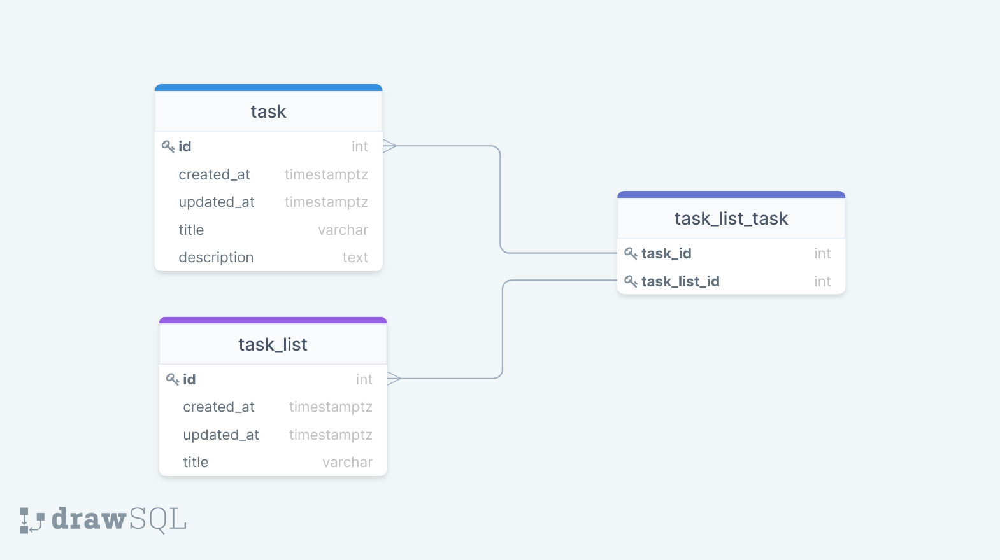

# Simple Koa Postgres API

### Requirements
* [Node.js](https://nodejs.org/en/download/) 
* [Docker](https://docs.docker.com/desktop/) & [Docker compose](https://docs.docker.com/compose/)

###  Environment setup
This project requires a `.env` file to be present in root directory.
* Use `env.template` as a starting point for creating an `.env` file. 

## Getting started

```bash
# Install packages
$ npm i

# Start database container
$ docker-compose up -d

# Start development server
$ npm run devServer

# Run tests
$ npm run test
```

### Database

